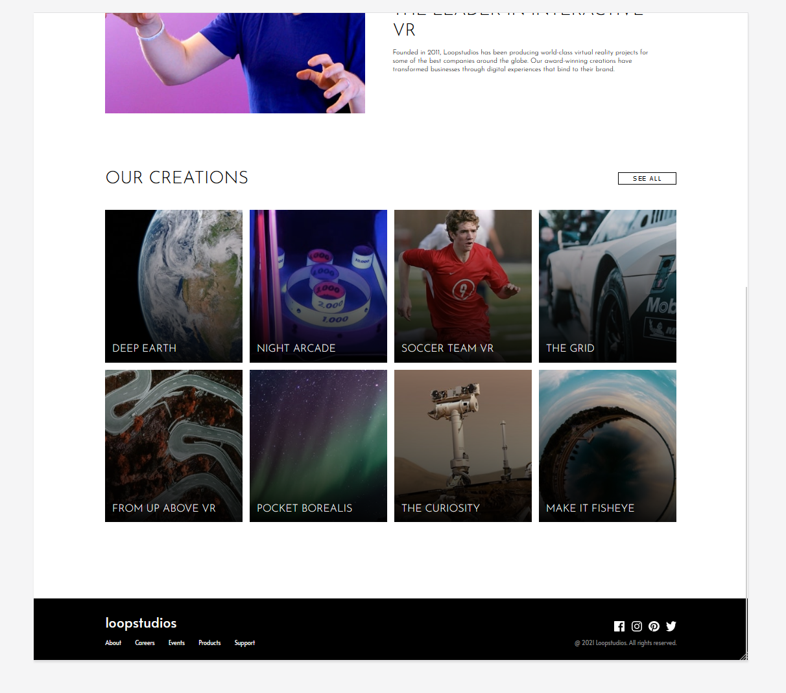

# Frontend Mentor - Loopstudios landing page solution

This is a solution to the [Loopstudios landing page challenge on Frontend Mentor](https://www.frontendmentor.io/challenges/loopstudios-landing-page-N88J5Onjw). 

## Table of contents

- [Overview](#overview)
  - [The challenge](#the-challenge)
  - [Screenshots](#screenshots)
- [My process](#my-process)
  - [Built with](#built-with)
  - [What I learned](#what-i-learned)
- [How to run](#how-to-run)
- [Author](#author)

## Overview

### The challenge

Users should be able to:

- View the optimal layout for the site depending on their device's screen size
- See hover states for all interactive elements on the page   
  ⚠️ Disclaimer: I did not implement all hover states. In this challenge I focused on the css and not on the js part. Especially the navigation is still lacking. Might change that later on...

### Screenshots
<p align="right">
  
  
</p>
<p align="left">


</p>


## My process

### Built with

- SCSS
- BEM css methodology
- JavaScript

### What I learned

I got a little more experienced in the BEM css naming convention and scss alltogether, especially grids.   
I also focused more on SCSS more advanced features like functions, mixins and predefined classes. 


```scss
$breakpoints: (
  'medium': 768px,
  'large': 1440px,
);

@mixin breakpoint($size) {
  $breakpoint: map-get($breakpoints, $size);
  @if $breakpoint {
    @media (min-width: $breakpoint) {
      @content;
    }
  } @else {
    @warn "No value found for breakpoint: #{$size}";
  }
}
```

```scss
%font-atlanta {
  font-family: var(--font-alata);
  font-weight: var(--font-weight-alata);
}
```
## How to run

> Prerequisites:
> - Node.js ```npm init```
> - Sass ```npm i sass```

Type following command into the terminal to start the conversion of SCSS into CSS:   
```batch
sass --watch scss:css
```

## Author

Annalisa Comin
